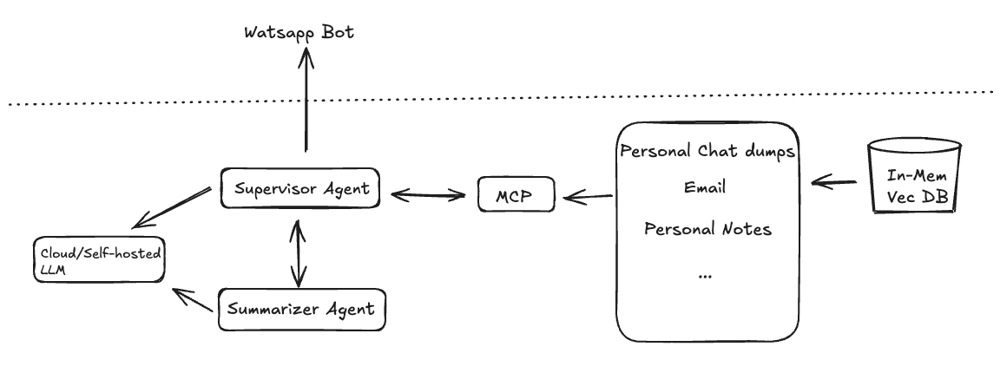

## Watsapp based Personal Assistant
Designing a trustworthy personal assistant that has access to our private data—yet guarantees to complete data privacy and security—is a challenge. This demo aims to explore a potential solution to this problem. The prototype is built around a personal AI assistant accessible via a WhatsApp bot. This assistant can be queried across various personal data channels that we commonly interact with.

#### Notes
- The assistant operates through a dummy WhatsApp number for demonstration purposes
- To mimic real-world usage, the proof-of-concept uses mock personal WhatsApp chat data, along with sample personal information in formats such as text files and dummy email data.
- The following is a very high level design of the system
 
 

 
- I try to use a very simple LLM based agent that has access to different tools to query the respective personal channel.
- These tools are essentially Retrieval Augumented Systems that query the VecDB to retrieve similar contexts.
- As a layer of security, I attempt to wrap the tools as Model Context Protocol(MCP) services, which are accessed by our MCPHost (the watsapp bot) via an MCP Client.

