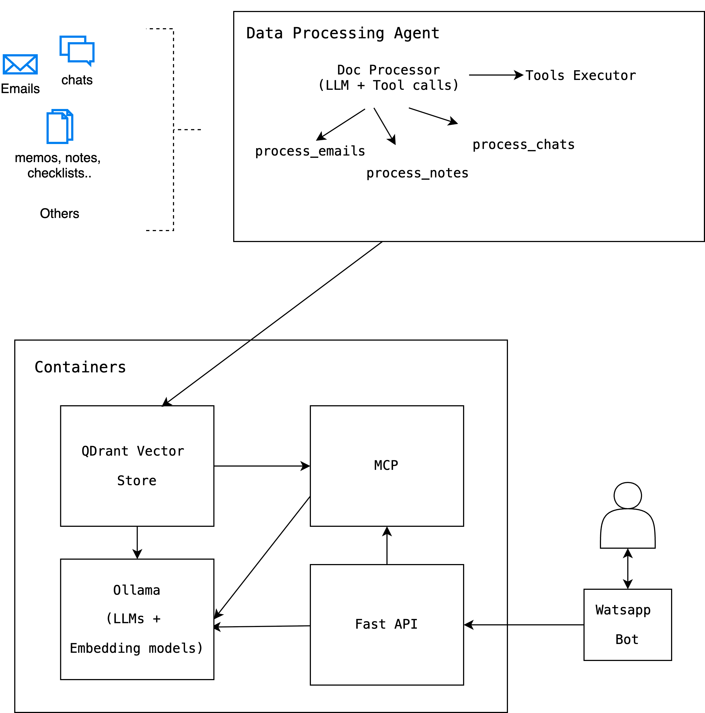

## WhatsApp based Personal Assistant
This project is a demo on how we can design, implement and host a personal WhatsApp based assistant. It explores the idea of an LLM powered agent that intelligently processes document categories based on its content and make them available for querying. The documents are then made searchable via a vector store via a Model Context Protocol (MCP) based server. All the services are exposed as self-hosted containers.

### High Level Design
<br><br>


As seen above it has 2 workflows - one to process different types of documents using appropriate tools, the other workflow is the actually app which consumes the documents.

### Steps to run the app

#### Setup Data
Dump all your documents in [this](backend/preprocessing/data) location OR use [this](backend/preprocessing/generate_samples.py) script to generate synthetic samples (which creates samples of emails, chat and notes)

#### Setup App
- If prefer using self-hosted solutions. Setup [Ollama](https://ollama.com/) in your machine to download required LLM and embedding models (I explored [Qwen3 0.6B](https://ollama.com/library/qwen3) and [Nomic Embed text](https://ollama.com/library/nomic-embed-text) as my LLM and embedding model respectively)
- Update the configs of the backend APIs [here](backend/utils/configs.py). Most of the config can remain the same except the following: `OLLAMA_EMBEDDING, OLLAMA_LLM, OPENAI_KEY, OPENAI_LLM, OPENAI_EMBEDDING, EMBEDDING_DIM`
do specify the models you would want to use provided by the Ollama framework, also if opting for cloud-based solution, I have used OpenAI in which case indicate the respective LLM and the key.
- Start the [Backend](backend) App via the `compose.yaml` using
```
cd backend
docker-compose up --build
```

#### Trigger Data Processing Agent
- The agent has access to a couple tools to process 3 document types: emails, WhatsApp chats, notes.
- Explore the already available tools from within the script [here](backend/preprocessing/agent_builder.py). Do add additional document processing tools if required (eg: processing tabular data such as CSVs, excels, PDFs etc)
- Trigger the agent which analyzes the files present in the [data path](backend/preprocessing/data) and calls the respective processing tools. Use the command (choose one of self_hosted or cloud for the model_type):
```
cd backend/
python3 preprocesing/entry_script.py --model_type [self_hosted or cloud]
```
#### Setup WhatsappBot
- Start the whatsapp bot service using:
```
cd frontend/
node app.js
```
- Scan the generated QR code from the console using a spare WhatsApp number which can act as your personal bot

#### Test the bot
- Create a WhatsApp group with yourself and the number which has been used to scan the QR-code earlier.
- Now, when you type any message in this group, you should get replies from the bot.


### Possible future Work:
- This is just a POC of a personal assistant that could be accessed via WhatsApp.
- There are a lot of room for improvement such as improving retrivails using Hybrid scorers such as BM25 and embedding, late-interaction vectors such as ColBERT's Multi-Vectors etc
- May be more powerful self-hosted LLMs and embedding models can also be integrated.
- Add support for more modalities such as images.

